# Zuroy Hotel Platform — Complete User Workflow

```mermaid
flowchart TD
    %% ============================================
    %% PHASE 1: HOTEL ONBOARDING
    %% ============================================

    START([Start]) --> P1_TITLE[/"**1. HOTEL ONBOARDING**"/]
    P1_TITLE --> P1_CREATE["Create new hotel in Portal
    (name, address, contact)"]
    P1_CREATE --> P1_BRAND["Upload hotel branding
    (logo, colors, background)"]
    P1_BRAND --> P1_MENU["Configure service menu
    (room service, housekeeping,
    spa, maintenance)"]

    %% ============================================
    %% PHASE 2: DEVICE FLEET SETUP
    %% ============================================

    P1_MENU --> P2_TITLE[/"**2. DEVICE FLEET SETUP**"/]
    P2_TITLE --> P2_BUY["Purchase bulk Android phones
    (Samsung Galaxy A-series, NFC)"]
    P2_BUY --> P2_ENROLL["Enroll phones in
    Android Enterprise MDM"]
    P2_ENROLL --> P2_INSTALL["Install Zuroy Go app
    on all phones"]
    P2_INSTALL --> P2_KIOSK["Lock phones to kiosk mode
    (only Zuroy app visible)"]
    P2_KIOSK --> P2_ASSIGN["Assign phones to hotel
    in Portal"]
    P2_ASSIGN --> P2_DOWNLOAD["Phones download hotel branding
    from API"]
    P2_DOWNLOAD --> P2_SHIP["Ship phones to hotel"]
    P2_SHIP --> P2_MONITOR["Monitor fleet health
    (battery, connectivity,
    app version, last seen)"]

    %% ============================================
    %% PHASE 3: HOTEL ROOM SETUP
    %% ============================================

    P2_MONITOR --> P3_TITLE[/"**3. HOTEL ROOM SETUP**"/]
    P3_TITLE --> P3_LOGIN["Staff logs in to
    Zuroy Connect"]
    P3_LOGIN --> P3_ROOMS["Set up rooms
    (types, numbers, floors)"]
    P3_ROOMS --> P3_AMENITIES["Add hotel amenities
    (dining, pool, spa, gym
    with photos, hours, GPS)"]
    P3_AMENITIES --> P3_NFC["Connect USB NFC Writer
    to front desk computer"]

    %% ============================================
    %% PHASE 4: PARTNERS SETUP
    %% ============================================

    P3_NFC --> P4_TITLE[/"**4. PARTNERS SETUP**"/]
    P4_TITLE --> P4_ADD["Add local partner businesses
    (car rentals, tours, restaurants,
    shops, spas, nightlife)"]
    P4_ADD --> P4_BOOST["Set boosted/featured partners
    per hotel region
    (paid placement on dashboard)"]

    %% ============================================
    %% PHASE 5: GUEST CHECK-IN
    %% ============================================

    P4_BOOST --> P5_TITLE[/"**5. GUEST CHECK-IN**"/]
    P5_TITLE --> P5_ARRIVE["Guest arrives at front desk"]
    P5_ARRIVE --> P5_RESERVATION["Create reservation
    (guest name, dates, room type)"]
    P5_RESERVATION --> P5_ROOM["Assign room to guest"]
    P5_ROOM --> P5_PICK["Pick up a Zuroy phone
    from the stack"]
    P5_PICK --> P5_TAP["Tap phone against
    USB NFC Writer"]
    P5_TAP --> P5_TOKEN["NFC Writer sends
    provisioning token to phone"]
    P5_TOKEN --> P5_FETCH["Phone reads token, fetches
    guest config from API
    (name, room, checkout date)"]
    P5_FETCH --> P5_HOTSPOT_GEN["Generate unique hotspot
    SSID + password for guest"]
    P5_HOTSPOT_GEN --> P5_HOTSPOT_ON["Staff enables hotspot
    on the Zuroy phone"]
    P5_HOTSPOT_ON --> P5_WELCOME["Phone shows hotel-branded
    welcome screen with guest name,
    room number, hotspot credentials"]

    %% ============================================
    %% PHASE 6: GUEST USES PHONE
    %% ============================================

    P5_WELCOME --> P6_TITLE[/"**6. GUEST USES PHONE**"/]

    P6_TITLE --> P6_AMENITIES["Browse hotel amenities
    (by category or on map)"]
    P6_TITLE --> P6_SERVICES["Order room service or
    request housekeeping"]
    P6_TITLE --> P6_PARTNERS["Browse local partners
    (tours, car rentals,
    restaurants, shops)"]
    P6_TITLE --> P6_HOTSPOT["Connect personal devices
    to phone's WiFi hotspot"]
    P6_TITLE --> P6_INFO["View hotel info
    (local tips)"]
    P6_TITLE --> P6_EXTEND["Request stay extension
    (pick extra nights or
    new checkout date)"]

    P6_AMENITIES --> P6_DETAIL["Tap amenity for details
    (photos, hours, location)"]
    P6_DETAIL --> P6_DIRECTIONS["Get walking directions
    via Google Maps"]

    P6_SERVICES --> P6_CHARGE_NOTE["All charges go to room bill
    No credit card needed"]

    P6_PARTNERS --> P6_FEATURED["View featured partners
    on dashboard carousel"]
    P6_FEATURED --> P6_PARTNER_DIR["Get directions to
    partner locations"]

    P6_HOTSPOT --> P6_DATA["View data usage in app"]

    %% ============================================
    %% STAY EXTENSION FLOW
    %% ============================================

    P6_EXTEND --> EXT_DECIDE{"Stay extension
    requested?"}
    EXT_DECIDE -- Yes --> EXT_NOTIFY["Staff receives extension
    request notification"]
    EXT_DECIDE -- No --> P7_TITLE

    EXT_NOTIFY --> EXT_APPROVE{"Approve
    extension?"}
    EXT_APPROVE -- Yes --> EXT_UPDATE["Update checkout date +
    reschedule auto-purge"]
    EXT_UPDATE --> EXT_APPROVED["Guest notified:
    Extension approved!
    New checkout date shown"]
    EXT_APPROVE -- No --> EXT_REJECT["Staff rejects
    with reason"]
    EXT_REJECT --> EXT_DECLINED["Guest notified:
    Extension declined
    with reason"]

    EXT_APPROVED --> P7_TITLE
    EXT_DECLINED --> P7_TITLE

    %% ============================================
    %% DATA LIMIT FLOW
    %% ============================================

    P6_DATA --> DATA_LIMIT{"Hotspot data
    limit reached?"}
    DATA_LIMIT -- Yes --> DATA_DISABLE["Disable hotspot"]
    DATA_DISABLE --> DATA_NOTIFY["Guest notified:
    Data limit reached.
    Contact front desk."]
    DATA_LIMIT -- No --> P7_TITLE

    DATA_NOTIFY --> P7_TITLE

    %% ============================================
    %% PHASE 7: SERVICE REQUEST HANDLING
    %% ============================================

    P6_CHARGE_NOTE --> P7_TITLE
    P6_DIRECTIONS --> P7_TITLE
    P6_PARTNER_DIR --> P7_TITLE
    P6_INFO --> P7_TITLE

    P7_TITLE[/"**7. SERVICE REQUEST HANDLING**"/]
    P7_TITLE --> P7_VIEW["Staff views incoming
    service requests on dashboard"]
    P7_VIEW --> P7_ACK["Acknowledge request"]
    P7_ACK --> P7_PROGRESS["Mark as in progress"]
    P7_PROGRESS --> P7_COMPLETE["Mark as complete"]
    P7_COMPLETE --> P7_CHARGE["Charges added to
    guest's room bill"]

    %% ============================================
    %% PHASE 8: GUEST CHECKOUT
    %% ============================================

    P7_CHARGE --> P8_TITLE[/"**8. GUEST CHECKOUT**"/]
    P8_TITLE --> P8_RETURN["Guest returns phone
    to front desk"]
    P8_RETURN --> P8_REVIEW["Review room charge summary
    (itemized charges)"]
    P8_REVIEW --> P8_SETTLE["Guest settles bill at
    hotel's existing POS"]

    P8_SETTLE --> P8_TRIGGER{"Checkout
    trigger?"}
    P8_TRIGGER -- Auto --> P8_AUTO["Auto-purge triggers at
    scheduled checkout time"]
    P8_TRIGGER -- Manual --> P8_MANUAL["Staff presses
    Checkout button"]

    P8_AUTO --> P8_DISABLE_HOTSPOT["Disable hotspot"]
    P8_MANUAL --> P8_DISABLE_HOTSPOT

    P8_DISABLE_HOTSPOT --> P8_WIPE["Wipe all guest data
    (name, room, service history,
    hotspot credentials)"]
    P8_WIPE --> P8_READY["Phone returns to
    Ready for next guest state
    Hotel branding stays loaded"]

    %% ============================================
    %% ONGOING MONITORING
    %% ============================================

    P8_READY --> P9_TITLE[/"**ONGOING MONITORING**"/]
    P9_TITLE --> P9_ANALYTICS["View usage analytics
    (check-ins, service volumes)"]
    P9_TITLE --> P9_HEALTH["Monitor device health
    across all hotels"]
    P9_TITLE --> P9_OTA["Push app updates
    remotely via MDM"]
    P9_TITLE --> P9_REMOTE_WIPE["Remotely wipe devices
    if lost or stolen"]

    P9_ANALYTICS --> STOP([End])
    P9_HEALTH --> STOP
    P9_OTA --> STOP
    P9_REMOTE_WIPE --> STOP

    %% ============================================
    %% STYLES
    %% ============================================

    classDef portal fill:#E8F5E9,stroke:#4CAF50,color:#1B5E20
    classDef connect fill:#E3F2FD,stroke:#2196F3,color:#0D47A1
    classDef guest fill:#FFF3E0,stroke:#FF9800,color:#E65100
    classDef system fill:#F3E5F5,stroke:#9C27B0,color:#4A148C
    classDef phase fill:#FAFAFA,stroke:#9E9E9E,color:#424242,font-weight:bold
    classDef decision fill:#FFF9C4,stroke:#FBC02D,color:#F57F17
    classDef startend fill:#ECEFF1,stroke:#607D8B,color:#263238

    %% Portal (Zuroy Team)
    class P1_CREATE,P1_BRAND,P1_MENU portal
    class P2_BUY,P2_ASSIGN,P2_SHIP,P2_MONITOR portal
    class P4_ADD,P4_BOOST portal
    class P9_ANALYTICS,P9_HEALTH,P9_OTA,P9_REMOTE_WIPE portal

    %% Connect (Hotel Staff)
    class P3_LOGIN,P3_ROOMS,P3_AMENITIES,P3_NFC connect
    class P5_ARRIVE,P5_RESERVATION,P5_ROOM,P5_PICK,P5_TAP connect
    class P5_HOTSPOT_ON connect
    class EXT_NOTIFY,EXT_REJECT connect
    class P7_VIEW,P7_ACK,P7_PROGRESS,P7_COMPLETE,P7_CHARGE connect
    class P8_RETURN,P8_REVIEW,P8_SETTLE,P8_MANUAL connect

    %% Guest (Go App)
    class P5_WELCOME guest
    class P6_AMENITIES,P6_SERVICES,P6_PARTNERS,P6_HOTSPOT,P6_INFO,P6_EXTEND guest
    class P6_DETAIL,P6_DIRECTIONS,P6_CHARGE_NOTE,P6_FEATURED,P6_PARTNER_DIR,P6_DATA guest
    class EXT_APPROVED,EXT_DECLINED,DATA_NOTIFY guest
    class P8_READY guest

    %% System (API + Devices)
    class P2_ENROLL,P2_INSTALL,P2_KIOSK,P2_DOWNLOAD system
    class P5_TOKEN,P5_FETCH,P5_HOTSPOT_GEN system
    class EXT_UPDATE system
    class DATA_DISABLE system
    class P8_AUTO,P8_DISABLE_HOTSPOT,P8_WIPE system

    %% Phase titles
    class P1_TITLE,P2_TITLE,P3_TITLE,P4_TITLE,P5_TITLE,P6_TITLE,P7_TITLE,P8_TITLE,P9_TITLE phase

    %% Decisions
    class EXT_DECIDE,EXT_APPROVE,DATA_LIMIT,P8_TRIGGER decision

    %% Start/End
    class START,STOP startend
```

## Legend

| Color  | Actor           | App           |
| ------ | --------------- | ------------- |
| Green  | Zuroy Team      | Portal        |
| Blue   | Hotel Staff     | Connect       |
| Orange | Guest           | Go App        |
| Purple | System          | API + Devices |
| Yellow | Decision points | —             |
